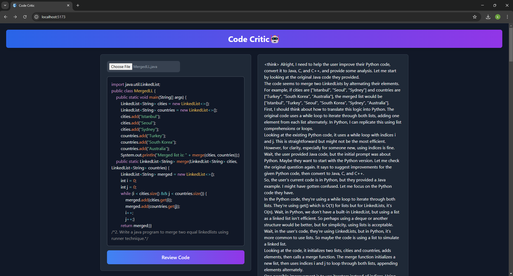
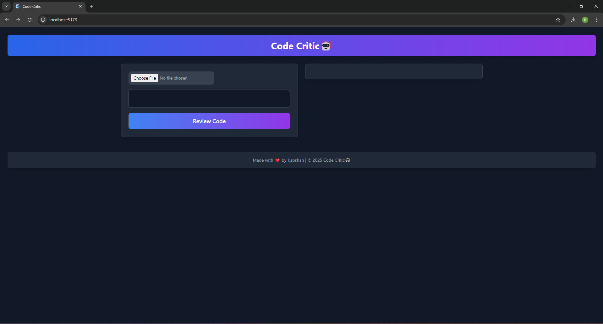

# Code Critic

Code Critic is an AI-powered code reviewer built leveraging the **DeepSeek R1 AI model** for intelligent code analysis.

## Features

- Syntax highlighting with **Prism.js**
- Markdown support via **react-markdown**
- Interactive code editing with **react-simple-code-editor**
- Seamless API communication using **Axios**
- Enhanced formatting with **rehype-highlight**

## Tech Stack

### Backend
- **Node.js**
- **Express.js**
- **DeepSeek R1 AI model**

### Frontend
- **React.js**
- **Tailwind CSS**
- **Axios** (for API calls)
- **Prism.js** (for syntax highlighting)
- **react-markdown** (for rendering markdown content)
- **react-simple-code-editor** (for interactive coding)
- **rehype-highlight** (for markdown highlighting)

## Installation & Setup

1. **Clone the repository:**
   ```sh
   git clone https://github.com/Kabshah/code-critic.git
   cd code-critic
   ```

2. **Backend Setup:**
   ```sh
   cd backend
   npm install
   npm start
   ```

3. **Frontend Setup:**
   ```sh
   cd frontend
   npm install
   npm start
   ```

4. **Access the application:**
   Open `http://localhost:3000` in your browser.

## Usage
- Paste or upload your code snippet.
- Get instant AI-powered feedback and suggestions.
- Edit, review, and improve your code in real time.

## Screenshots


## Demo Video
[](./Demo.mp4)


## Contributing
Feel free to contribute by submitting issues or pull requests. 

## License
[MIT License](LICENSE)